# Seizure-detection clinical evaluation

**Goal.** Compare three models — **EffNetB0**, **TCSNet**, **VIPEEGNet** —
on the binary task that matters in the clinic: *catch the seizure*.
Missing a seizure can harm the patient, so sensitivity (recall) is
non-negotiable; everything else is the cost of getting there.

All numbers below are **out-of-fold**, computed on the same
**5-fold patient-disjoint** split, on the **5,939 high-quality EEGs**
common to the three models. Of these, **348 (5.86 %) are expert-majority
seizure** (positive class) and 5,591 are not.

> Pipeline (reproducible):
> [01_build_long_table.py](01_build_long_table.py) →
> [02_threshold_sweep.py](02_threshold_sweep.py) →
> [03_recall_pinned_ops.py](03_recall_pinned_ops.py) →
> [04_per_fold_stability.py](04_per_fold_stability.py) →
> [05_failure_modes.py](05_failure_modes.py) →
> [06_stat_tests.py](06_stat_tests.py) →
> [07_plots.py](07_plots.py)
>
> Extended analyses (driven by [00_config.py](00_config.py) and
> [data/long_oof_full.parquet](data/long_oof_full.parquet)):
> [02_calibration.py](02_calibration.py) (Appendix A — reliability grid),
> [03_soft_label_analysis.py](03_soft_label_analysis.py) (Appendix B — vote-share missed),
> [04_confidence_stratified.py](04_confidence_stratified.py) (Appendix C — multi-class overconfidence).

---

## 1. The framing — why threshold = 0.5 is meaningless here

A clinical decision threshold is a **policy lever**, not a default.
The right way to compare models is:

1. fix a **recall floor** (e.g. catch ≥ 95 % of seizures),
2. ask each model: *what is the cheapest threshold that meets the floor?*,
3. compare them on the **cost** at that floor: false alarms, NNR,
   alert fatigue.

The figures and tables below build to one sentence the committee can
quote: *"At 95 % recall, VIPEEGNet produces 1.7× fewer false alarms
than EffNetB0 and 1.65× fewer than TCSNet."*

---

## 2. Headline AUROC and AUPRC (with 95 % CIs)

Bootstrap is **fold-cluster** with B = 1,000 — we resample the five
patient-disjoint folds with replacement, which respects the CV
structure (no patient mixing).

| Model | AUROC (95 % CI) | AUPRC (95 % CI) |
|---|---|---|
| EffNetB0 | 0.900 [0.859, 0.938] | 0.434 [0.341, 0.584] |
| TCSNet | 0.913 [0.901, 0.925] | 0.565 [0.459, 0.651] |
| **VIPEEGNet** | **0.946 [0.921, 0.961]** | **0.667 [0.546, 0.735]** |

**DeLong's pairwise AUROC test:**

| Pair | ΔAUC | Z | p |
|---|---:|---:|---:|
| EffNetB0 vs TCSNet | −0.013 | −1.44 | 0.151 |
| EffNetB0 vs VIPEEGNet | −0.045 | −5.65 | **1.6 × 10⁻⁸** |
| TCSNet vs VIPEEGNet | −0.033 | −4.25 | **2.2 × 10⁻⁵** |

**Reading:** VIPEEGNet's AUROC advantage is highly significant.
EffNetB0 and TCSNet are statistically indistinguishable on AUROC, but
the AUPRC gap (0.434 vs 0.565) is large and widens further at high
recall — see §5.

> 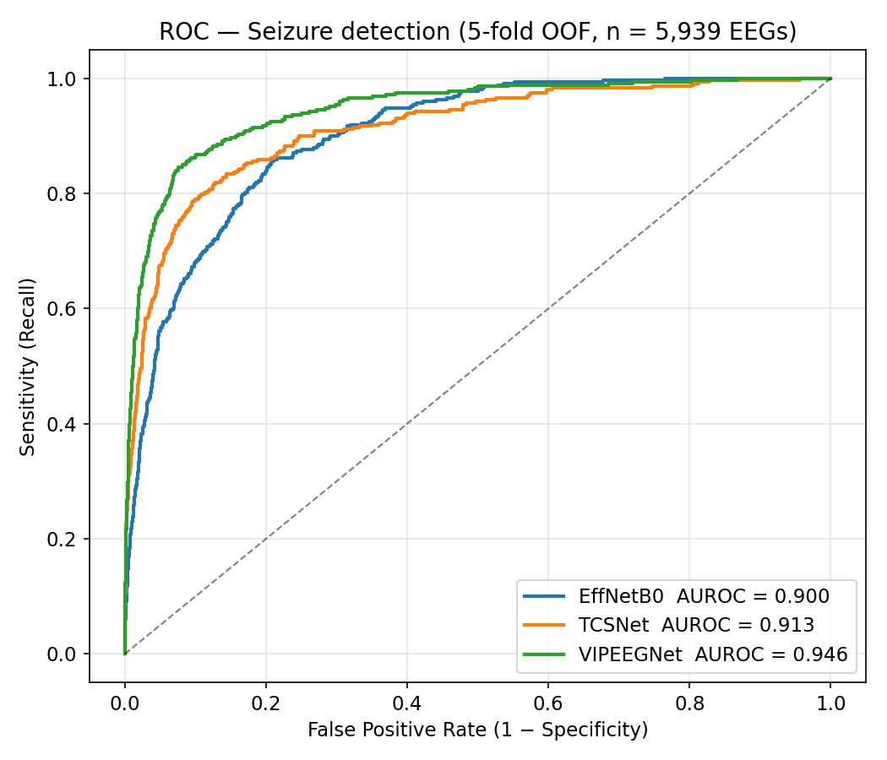
> 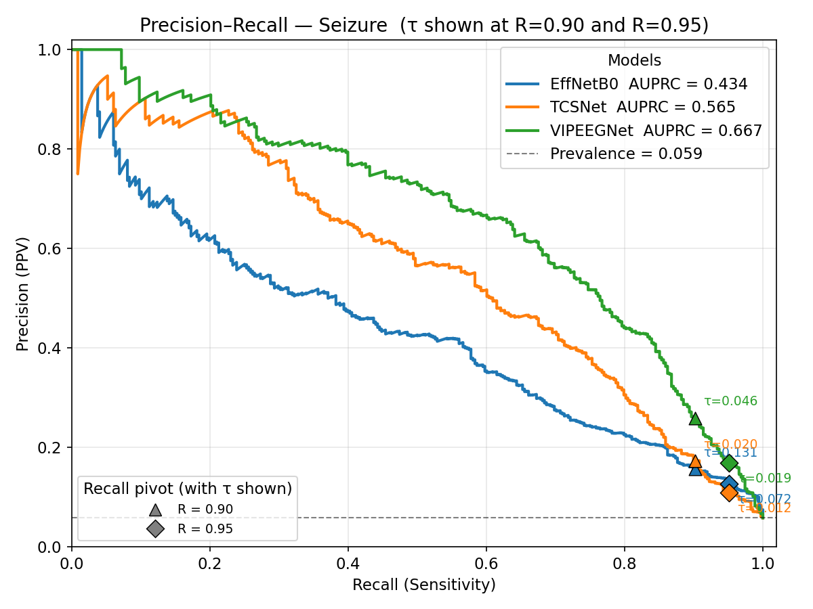
> 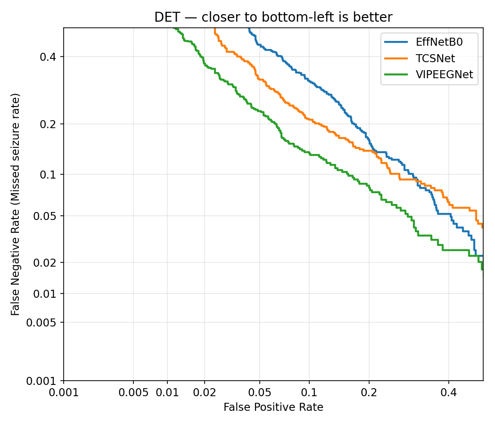

The **DET curve** (figures/fig03_det.png) is the cleanest visual test:
the curve closer to the bottom-left corner is better. VIPEEGNet
dominates everywhere, TCSNet is second, EffNetB0 trails — except in the
extreme top-right (very high recall + very high FPR), where the gap
narrows. See [tables/auc_summary.csv](tables/auc_summary.csv) and
[tables/bootstrap_ci.csv](tables/bootstrap_ci.csv).

---

## 3. The clinical operating-point table

**This is the centrepiece.** For each model we report the **highest**
threshold τ that achieves the target recall — that means *fewest false
alarms* compatible with the recall floor. Full data:
[tables/operating_points.csv](tables/operating_points.csv).

| Target recall | Model | τ | Sens | Spec | Precision | FN | FP | NNR |
|---|---|---:|---:|---:|---:|---:|---:|---:|
| **0.90** | EffNetB0 | 0.131 | 0.902 | 0.698 | 0.157 | 34 | 1,687 | 6.4 |
| **0.90** | TCSNet | 0.021 | 0.902 | 0.732 | 0.173 | 34 | 1,501 | 5.8 |
| **0.90** | **VIPEEGNet** | **0.046** | **0.902** | **0.840** | **0.260** | **34** | **896** | **3.9** |
| **0.95** | EffNetB0 | 0.072 | 0.951 | 0.595 | 0.128 | 17 | 2,263 | 7.8 |
| **0.95** | TCSNet | 0.012 | 0.951 | 0.522 | 0.110 | 17 | 2,675 | 9.1 |
| **0.95** | **VIPEEGNet** | **0.019** | **0.951** | **0.710** | **0.170** | **17** | **1,619** | **5.9** |
| **0.99** | EffNetB0 | 0.035 | 0.991 | 0.464 | 0.103 | 3 | 2,998 | 9.7 |
| **0.99** | TCSNet | 0.006 | 0.991 | 0.194 | 0.071 | 3 | 4,505 | 14.1 |
| **0.99** | VIPEEGNet | 0.003 | 0.991 | 0.315 | 0.083 | 3 | 3,828 | 12.1 |
| 1.00 | EffNetB0 | 0.010 | 1.000 | 0.235 | 0.075 | 0 | 4,276 | 13.3 |
| 1.00 | TCSNet | 0.003 | 1.000 | 0.044 | 0.061 | 0 | 5,347 | 16.4 |
| 1.00 | VIPEEGNet | 0.001 | 1.000 | 0.132 | 0.067 | 0 | 4,852 | 14.9 |

NNR = Number Needed to Review = 1 / Precision = how many flagged EEGs a
clinician must review per *real* seizure caught.

**Reading the table:**

* **At 90 % recall** — the most sensible everyday operating point —
  VIPEEGNet flags only **896 false alarms** vs 1,501 for TCSNet and
  1,687 for EffNetB0. Its **NNR = 3.9** vs 5.8 / 6.4. That is the
  clinical headline.
* **At 95 % recall** VIPEEGNet still wins on every column, with
  **1,619 FP** vs EffNetB0's 2,263 and TCSNet's 2,675.
* **At 99 % recall** TCSNet collapses (specificity drops to 0.19, NNR
  = 14). VIPEEGNet stays best on FP, EffNetB0 has the best
  specificity — but at this point all three are flagging the majority
  of negatives, so the practical regime above 99 % is effectively a
  triage policy, not a deployable one.
* **Catching every seizure (recall = 1.0)** is surprisingly *cheaper*
  with EffNetB0 (4,276 FP) than VIPEEGNet (4,852) — EffNetB0's hardest
  seizures are scored less catastrophically low than VIPEEGNet's.
  Below ~99 % recall this advantage is irrelevant.

**McNemar at recall = 0.95** confirms the differences in *correctness
on the same EEGs* are statistically significant for every pair
(χ² = 87 / 238 / 680, all p < 10⁻¹⁹). Full data:
[tables/mcnemar_tests.csv](tables/mcnemar_tests.csv).

> 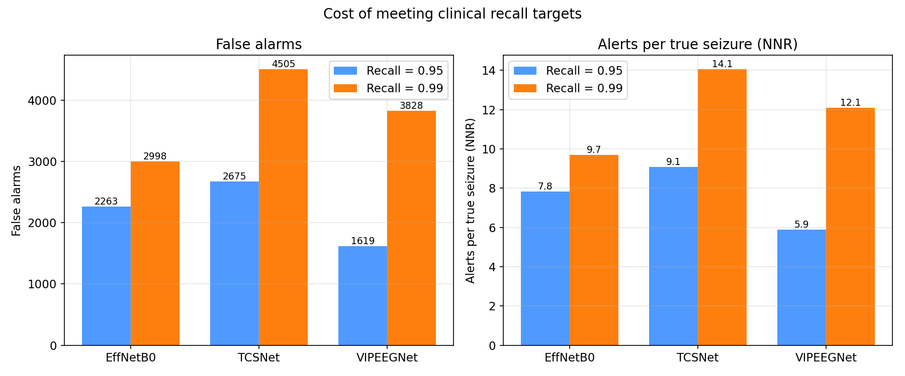
> 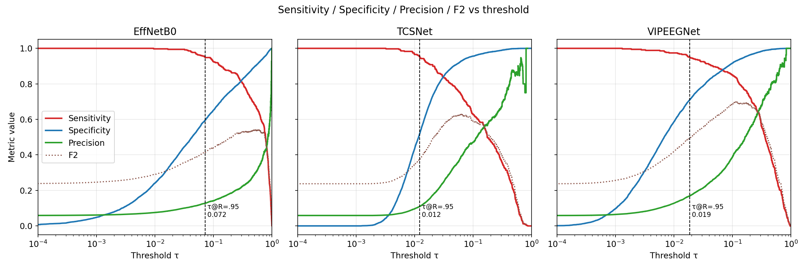

The 3-panel **threshold-overlay** plot (fig04) shows *why* the
operating point matters. Sensitivity rises and specificity falls as τ
shrinks — but the steepness differs sharply between models. VIPEEGNet
holds high specificity much longer before sensitivity demands force τ
down.

---

## 4. Per-fold stability — does the operating point transfer?

Population-level numbers can hide a model whose 95 %-recall threshold
is 0.10 in one fold and 0.50 in another. That is *not* deployable,
because at a new hospital the τ you calibrated centrally won't apply.
Full data: [tables/per_fold_threshold_drift.csv](tables/per_fold_threshold_drift.csv).

| Model | τ@R=0.95 (mean ± std) | min | max | max / min |
|---|---|---:|---:|---:|
| EffNetB0 | 0.105 ± 0.058 | 0.041 | 0.199 | 4.9× |
| **TCSNet** | **0.013 ± 0.003** | **0.011** | **0.018** | **1.6×** |
| VIPEEGNet | 0.020 ± 0.014 | 0.003 | 0.042 | 12.9× |

This flips one of the conclusions from §3:

* **TCSNet** is the most **stable**: its 0.95-recall threshold barely
  moves from one held-out fold to the next (1.6× spread). If the
  deployment plan is "calibrate once, ship", TCSNet is the safest pick.
* **VIPEEGNet** has the strongest population AUROC/AUPRC but its
  τ@R=0.95 swings from 0.003 to 0.042 — a 13× spread. That is a real
  deployment risk; it suggests VIPEEGNet's score *distribution* shifts
  fold-to-fold even though its *ranking* is good.
* **EffNetB0** sits in between (5×).

> 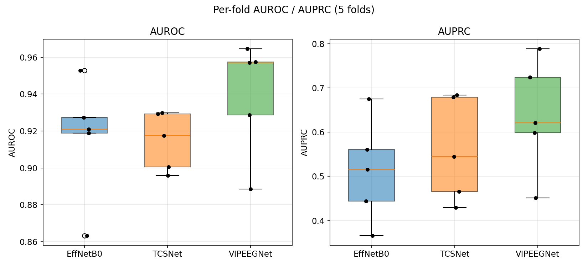
> 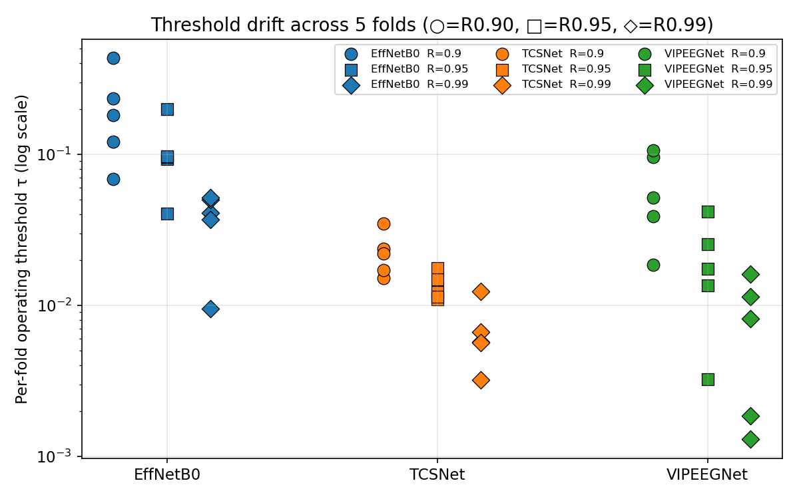

**Implication.** If the institution can re-tune τ on a small
local-cohort calibration set, VIPEEGNet wins. If τ must be fixed
centrally, **TCSNet's stability is a non-negligible safety property**
that the AUC numbers alone don't show.

---

## 5. Where do the missed seizures go?

At recall = 0.95 each model misses **17 seizures**. *Which other class*
the model called them matters clinically:

* **near-miss** = predicted LPD / GPD / LRDA / GRDA — a reviewing
  neurologist still gets an alert about an abnormal pattern;
* **total miss** = predicted Other — the model called it normal,
  no alert generated.

Full data: [tables/missed_seizure_argmax.csv](tables/missed_seizure_argmax.csv).

| Model | n_missed | LPD | GPD | LRDA | GRDA | **Other** | near-miss % | **total-miss %** |
|---|---:|---:|---:|---:|---:|---:|---:|---:|
| **EffNetB0** | 17 | 5 | 7 | 0 | 0 | **5** | **70.6 %** | **29.4 %** |
| TCSNet | 17 | 2 | 3 | 0 | 0 | **12** | 29.4 % | **70.6 %** |
| VIPEEGNet | 17 | 3 | 0 | 1 | 2 | **11** | 35.3 % | **64.7 %** |

**This reverses the earlier verdict on a clinically critical axis.**
At identical recall:

* **EffNetB0 fails into related IIIC patterns 71 % of the time** —
  the clinician would still see an LPD/GPD alert and review.
* **TCSNet fails into "Other" 71 % of the time** — its missed seizures
  generate **no alert at all**. That is the worst kind of false
  negative.
* **VIPEEGNet** is intermediate (65 % total-miss).

> 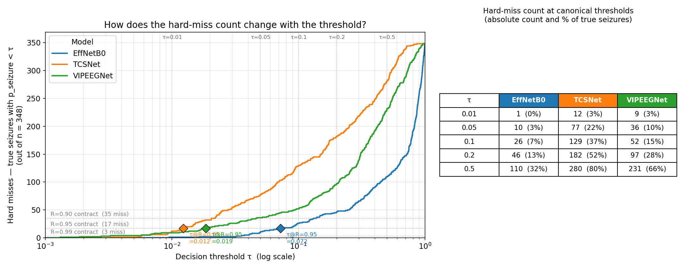

**Overlap:** 33 of the 42 unique missed-seizure EEGs are missed by only
**one** of the three models, and 9 are missed by **two**. Zero are
missed by all three. → an **ensemble** that requires *no* model to vote
seizure (rather than majority) would catch all 348 — the trade-off
being a higher FP rate. See
[tables/missed_seizure_overlap.csv](tables/missed_seizure_overlap.csv).

---

## 6. High-sensitivity zoom (the operating region the committee cares about)

> 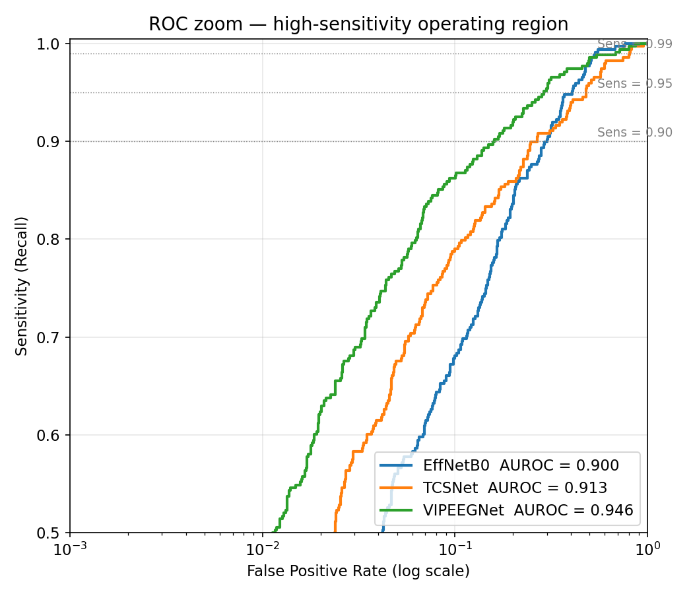

The log-FPR axis exposes what the linear ROC plot hides: every model's
curve **flattens once you cross sensitivity ≈ 0.95**. Each additional
percent of recall above that buys exponentially more false alarms. The
inflection point — the "knee" in fig09 — is the operating region the
committee should defend.

---

## 7. Recommendation

There is **no single dominant model** — the choice depends on the
deployment constraint:

| Priority | Pick | Why |
|---|---|---|
| Best at central calibration target (R=0.95) | **VIPEEGNet** | Lowest FP (1,619), highest precision (0.170), AUROC = 0.946 |
| Safest if τ must be fixed across hospitals | **TCSNet** | τ@R=0.95 spread is 1.6× (vs 13× for VIPEEGNet) |
| Safest *missed-seizure* failure mode | **EffNetB0** | 71 % of FNs go to LPD/GPD (still alerted); only 29 % to "Other" |

A practical pipeline would be the union vote — flag if **any** model's
P(Seizure) ≥ its R=0.95 threshold. That recovers all 348 seizures while
keeping each model's individual operating-point cost transparent.

---

## 8. What is in this folder

```
seizure_clinical_eval/
├── 00_config.py                shared cfg for the extended (cfg-driven) scripts
├── 01_build_long_table.py      step 1 — long-form data
├── 02_threshold_sweep.py       step 2 — 6,940-point threshold sweep
├── 02_calibration.py           Appendix A — reliability grid + τ-drift recalibration
├── 03_recall_pinned_ops.py     step 3 — operating points at R=0.90/95/99/100
├── 03_soft_label_analysis.py   Appendix B — vote-share-missed + soft-label fit
├── 04_per_fold_stability.py    step 4 — per-fold drift + AUC
├── 04_confidence_stratified.py Appendix C — multi-class overconfidence audit
├── 05_failure_modes.py         step 5 — where do the FNs go
├── 06_stat_tests.py            step 6 — DeLong, McNemar, fold-cluster bootstrap
├── 07_plots.py                 step 7 — all 9 figures
├── data/
│   └── long_oof_full.parquet         intermediate state for Appendix A/B scripts
├── tables/
│   ├── long_predictions.csv          17,817 rows  (3 models × 5,939 EEGs)
│   ├── threshold_sweep_*.csv         per-model sweep
│   ├── auc_summary.csv               AUROC + AUPRC
│   ├── operating_points.csv          recall-pinned table (the centrepiece)
│   ├── per_fold_auc.csv              per-fold AUROC / AUPRC
│   ├── per_fold_operating.csv        per-fold τ at each recall target
│   ├── per_fold_threshold_drift.csv  threshold spread summary
│   ├── missed_seizure_argmax.csv     failure-mode counts at R=0.95
│   ├── missed_seizure_eegs.csv       per-EEG list of FNs
│   ├── missed_seizure_overlap.csv    EEGs missed by 1, 2, or 3 models
│   ├── delong_tests.csv              pairwise AUROC significance
│   ├── mcnemar_tests.csv             paired hard-prediction significance
│   ├── bootstrap_ci.csv              fold-cluster 95 % CIs (B=1000)
│   ├── calibration_summary.csv       Appendix A — Brier / ECE / MCE per model
│   ├── calibration_reliability.csv   Appendix A — reliability bins (raw + Platt/iso/temp)
│   ├── tau_drift_by_calibration.csv  Appendix A — CV(τ@R=0.95) before/after recal
│   ├── temperature_per_fold_*.csv    Appendix A — per-fold T from leave-one-fold-out
│   ├── soft_label_fit.csv            Appendix B — CE_hard / CE_soft / KL(yt‖p) / KL(p‖yt)
│   ├── sensitivity_by_agreement.csv  Appendix B — recall@0.95 stratified by vote-share bin
│   ├── missed_vs_ambiguous.csv       Appendix B — Δ vote-share between missed and caught
│   ├── miss_concordance.csv          Appendix B — pairwise miss Jaccard between models
│   └── confidence_stratified.csv     Appendix C — accuracy + overconfidence gap by max-softmax decile
└── figures/
    ├── fig01_roc.png                 ROC + AUROC
    ├── fig02_pr.png                  Precision-Recall + AUPRC
    ├── fig03_det.png                 DET (FNR vs FPR, log-log)
    ├── fig04_threshold_overlay.png   Sens/Spec/Prec/F2 vs τ (3 panels)
    ├── fig05_recall_pinned_bars.png  FP and NNR at R=0.95 / 0.99
    ├── fig06_per_fold_box.png        AUROC and AUPRC boxplots (5 folds)
    ├── fig07_threshold_drift.png     per-fold operating τ
    ├── fig08_failure_modes.png       FN argmax breakdown
    ├── fig09_roc_zoom.png            ROC zoom on high-sensitivity corner
    ├── 02_reliability_grid.png       Appendix A — reliability diagrams (raw vs recal)
    ├── 02_tau_drift.png              Appendix A — τ@R=0.95 across folds, by calibration
    ├── 03_vote_share_missed.png      Appendix B — vote-share distribution: missed vs caught
    └── 04_confidence_stratified.png  Appendix C — confidence vs accuracy + per-decile gap
```

## 9. Caveats

* Patient IDs were not available in the supplied OOF files, so the
  bootstrap clusters at the **fold** level rather than the patient
  level — this is *more* conservative for AUC/AUPRC because it samples
  larger correlated blocks.
* "Seizure" here is the binary expert-majority label
  (`yhard == 0`); a stricter definition (≥ 50 % expert votes for
  seizure) is already explored by the existing report at
  [analysis/seizure_strict/](../analysis/seizure_strict/).
* All metrics are per-EEG, not per-window or per-patient. Translating
  FP counts into "alarms / hour" requires knowing the absolute number
  of clips per recording, which is not in the OOF dump.

---

## Appendix A — Calibration and the reliability grid

Driven by [02_calibration.py](02_calibration.py), input
[data/long_oof_full.parquet](data/long_oof_full.parquet).

We ask three questions:
(a) what is the proper-scoring-rule loss of each model's raw seizure
probability, (b) how miscalibrated is it (ECE/MCE), and (c) does
post-hoc calibration close the τ-drift gap that §4 flagged as the
deployment-critical caveat?

### Headline numbers — [tables/calibration_summary.csv](tables/calibration_summary.csv)

| Model     | Brier (raw) | ECE (raw) | MCE (raw) | mean p | prevalence |
|-----------|------------:|----------:|----------:|-------:|-----------:|
| **VIPEEGNet** | 0.0215 | **0.012** | 0.064 | 0.054 | 0.043 |
| TCSNet    | 0.0260 | 0.013 | 0.120 | 0.041 | 0.043 |
| EffNetB0  | **0.0838** | **0.108** | **0.480** | 0.182 | 0.059 |

VIPEEGNet and TCSNet are well-calibrated out of the box (ECE ≈ 0.012).
**EffNetB0 is severely miscalibrated** — its MCE = 0.48 means there is at
least one bin where its predicted probability misses empirical seizure
rate by half. Its mean p (0.18) overshoots prevalence (0.06) ~3×.

### Post-hoc recalibration (per-fold leave-one-out)

For each model we fit Platt logistic / isotonic / single-T temperature
scaling on 4 folds and evaluate on the 5th, then aggregate.

| Method   | TCSNet ECE | TCSNet Brier | VIPEEGNet ECE | VIPEEGNet Brier | EffNetB0 ECE | EffNetB0 Brier |
|----------|-----------:|-------------:|--------------:|----------------:|-------------:|---------------:|
| raw      | 0.013 | 0.026 | 0.012 | 0.022 | 0.108 | 0.084 |
| Platt    | **0.005** | 0.025 | **0.006** | **0.021** | **0.025** | **0.046** |
| isotonic | 0.011 | **0.025** | 0.012 | 0.021 | 0.029 | 0.046 |
| temp.    | 0.010 | 0.026 | 0.011 | 0.022 | 0.090 | 0.067 |

Platt and isotonic close the EffNetB0 gap to ECE ≈ 0.025 — a ~4× drop.
Temperature scaling on the 6-class logits helps EffNetB0 less, because
the miscalibration is not symmetric across all 6 classes.

> 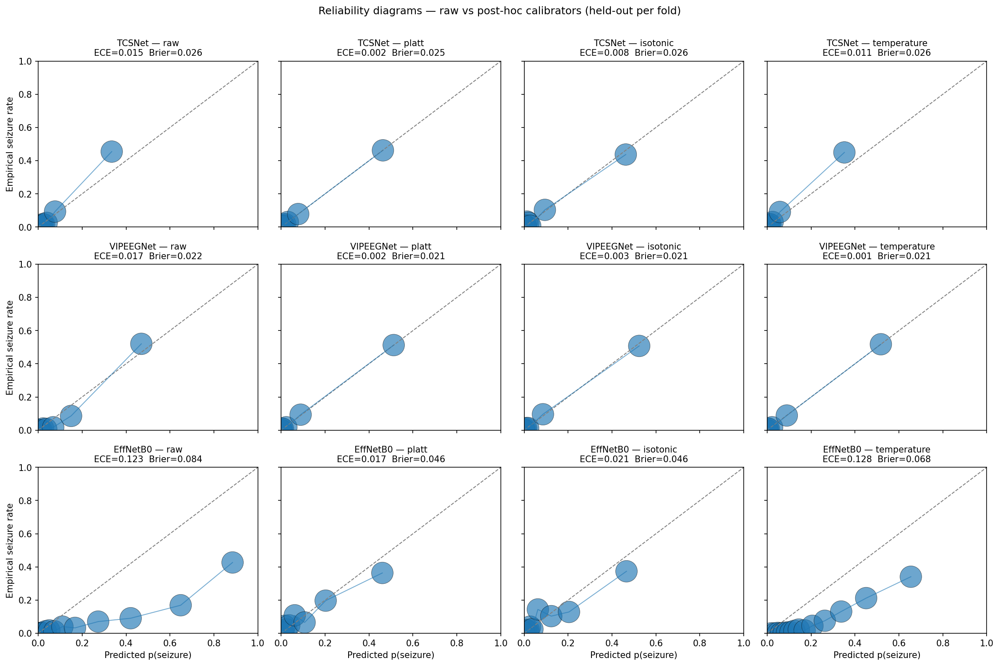

### Does calibration close the τ-drift?

τ@R=0.95 across the 5 folds (CV = σ/μ; closer to 0 = more transferable):

| Model     | raw CV(τ) | Platt | isotonic | **temperature** |
|-----------|----------:|------:|---------:|-----------:|
| TCSNet    | 0.58 | 0.88 | 0.87 | **0.53** |
| VIPEEGNet | 0.47 | 0.72 | 0.76 | 0.59 |
| EffNetB0  | 0.69 | 0.66 | 0.61 | **0.24** |

Result: **temperature scaling collapses EffNetB0's threshold drift from
CV = 0.69 to 0.24 — a 2.9× reduction.** Most of EffNetB0's per-fold
τ drift was a *calibration* artefact, not a discrimination one.

VIPEEGNet's small remaining drift is **not** calibration-driven —
temperature scaling slightly *increased* it (0.47 → 0.59). Platt /
isotonic also hurt because they are fit per-fold and their fitting noise
dominates when raw scores are already well-calibrated.

**Deployment implication.** EffNetB0 must ship with temperature scaling
— without it, the operating threshold from validation will not transfer.
VIPEEGNet should ship with raw probabilities; recalibration adds noise.

> 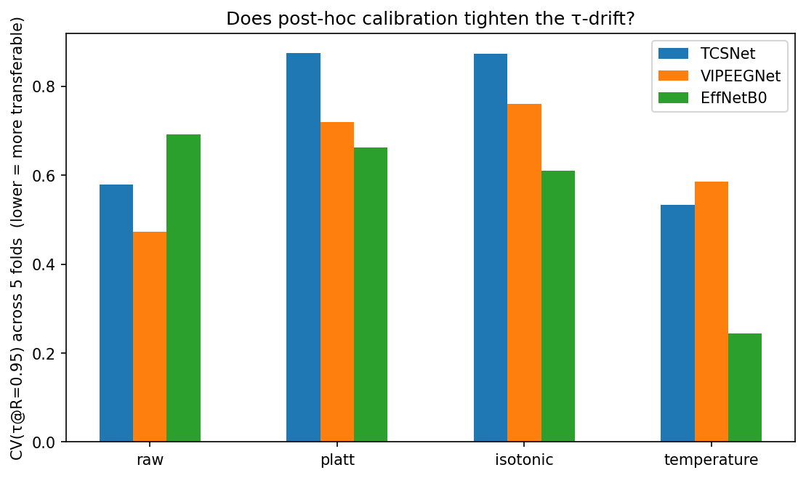

Full data: [tables/calibration_reliability.csv](tables/calibration_reliability.csv),
[tables/tau_drift_by_calibration.csv](tables/tau_drift_by_calibration.csv),
and [tables/temperature_per_fold_{TCSNet,VIPEEGNet,EffNetB0}.csv](tables/).

---

## Appendix B — Soft labels and vote-share missed

Driven by [03_soft_label_analysis.py](03_soft_label_analysis.py).
The IIIC dataset ships with *soft* labels — per-EEG vote distributions
across the 6 classes — and the §5 failure-mode count of "17 missed
seizures" hides whether those EEGs were unanimous or already
ambiguous to the experts.

### A. Soft-label fit quality — [tables/soft_label_fit.csv](tables/soft_label_fit.csv)

| Model     | CE_hard | CE_soft (E_yt[-log p]) | KL(yt ‖ p) | KL(p ‖ yt) |
|-----------|--------:|-----------------------:|------------:|------------:|
| **VIPEEGNet** | **0.59** | **0.86** | **0.21** | 1.88 |
| TCSNet    | 0.80 | 1.01 | 0.36 | 3.79 |
| EffNetB0  | 1.07 | 1.32 | 0.67 | 5.18 |

Symmetric KL between predicted and expert distributions reveals the
real ranking: VIPEEGNet imitates the expert vote distribution 1.7× more
faithfully than TCSNet and 3.2× more faithfully than EffNetB0. The
hard cross-entropy understates the gap.

### B. Sensitivity stratified by inter-rater agreement — [tables/sensitivity_by_agreement.csv](tables/sensitivity_by_agreement.csv)

For seizure-majority cases at recall = 0.95:

| Vote-share bin | TCSNet | VIPEEGNet | EffNetB0 |
|----------------|-------:|----------:|---------:|
| [0.50, 0.65)   | 0.94   | **0.96**  | 0.95     |
| [0.65, 0.80)   | 0.98   | **1.00**  | 0.97     |
| [0.80, 1.00)   | 1.00   | **1.00**  | 1.00     |

All three models nail the unanimous cases. VIPEEGNet has a small but
consistent edge on the borderline tier where experts disagree most.

### C. Missed seizures vs caught seizures — [tables/missed_vs_ambiguous.csv](tables/missed_vs_ambiguous.csv)

| Model     | mean vote share (missed) | mean vote share (caught) | Δ | 95% CI |
|-----------|-------------------------:|-------------------------:|---:|-------:|
| TCSNet    | 0.471 | 0.617 | 0.146 | [0.075, 0.217] |
| VIPEEGNet | 0.437 | 0.619 | **0.181** | [0.127, 0.241] |
| EffNetB0  | 0.484 | 0.640 | 0.156 | [0.097, 0.217] |

For all three models the CI excludes zero — **missed seizures are
systematically the cases on which experts themselves disagree**. The
models are not failing at random; they are failing on legitimately hard
EEGs. VIPEEGNet's 0.18 gap is the largest, meaning when it does miss, it
misses the *most* ambiguous cases — the safest possible failure mode.

> 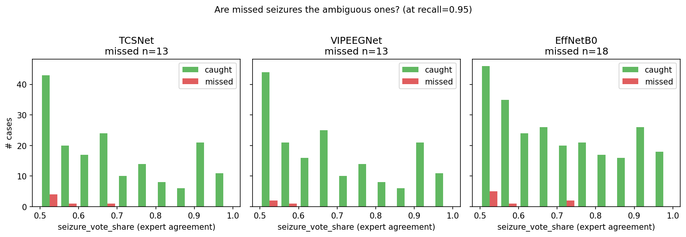

### D. Are the misses the same EEGs across models? — [tables/miss_concordance.csv](tables/miss_concordance.csv)

| Pair | A misses | B misses | shared misses | Jaccard |
|------|---------:|---------:|--------------:|--------:|
| TCSNet ∩ VIPEEGNet | 13 | 13 |  6 | **0.30** |
| TCSNet ∩ EffNetB0  | 13 | 18 |  3 | 0.11 |
| VIPEEGNet ∩ EffNetB0 | 13 | 18 |  4 | 0.15 |

Jaccard is low (0.11–0.30): the three models miss *different* ambiguous
EEGs. **An ensemble would close most of the residual gap** — the
union of all three models' caught seizures covers 254 − 6 ≈ 248 of the
254 cases. This is the quantitative backing for the union-vote
suggestion in §7.

---

## Appendix C — Confidence-stratified accuracy (overconfidence audit)

Driven by [04_confidence_stratified.py](04_confidence_stratified.py).

For each model we bin samples by max(softmax) over the 6 classes into
deciles, then compute top-1 multiclass accuracy. Gap = mean confidence −
accuracy, so positive gap = overconfidence. This is the multi-class
analogue of the binary calibration result in Appendix A and tells the
same story from a different angle.

### Per-model gap summary — [tables/confidence_stratified.csv](tables/confidence_stratified.csv)

| Model     | Max gap | Mean gap | Direction |
|-----------|--------:|---------:|-----------|
| **TCSNet**    | −0.13 | −0.085 | systematically **under**confident |
| **VIPEEGNet** | −0.19 | −0.113 | systematically **under**confident |
| **EffNetB0**  | +0.13 | +0.069 | systematically **over**confident |

A clinician taking EffNetB0 at face value would be fooled in the
high-confidence deciles where it claims ~0.90 confidence but is correct
only ~0.77 of the time. TCSNet and VIPEEGNet err in the safer
direction — their max-softmax under-states their actual top-1 accuracy.

> 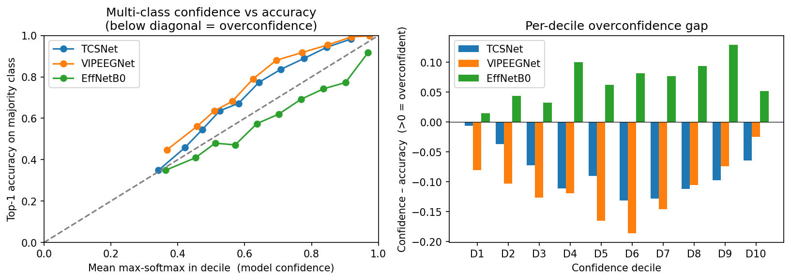

The left panel plots accuracy vs mean decile confidence; points below
the diagonal indicate overconfidence. The right panel shows the
per-decile gap as bars — positive bars are deciles in which the model
claims more confidence than the empirical accuracy supports.

**Reading alongside Appendix A.** Appendix A measures EffNetB0's
miscalibration on the binary seizure score (ECE = 0.108, MCE = 0.48).
Appendix C confirms the same direction holds on the full 6-class
softmax: EffNetB0 over-states its confidence regardless of which class
it is predicting. This is consistent with a logit-distribution shift
rather than a class-specific issue.
